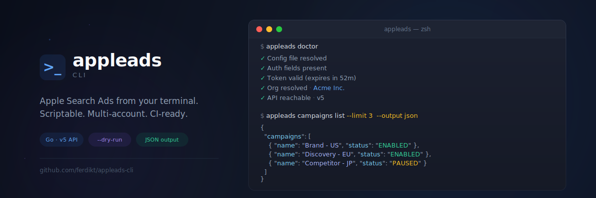

<p align="center">
  
</p>

<h1 align="center">appleads</h1>

<p align="center">
  <strong>A powerful CLI for Apple Search Ads</strong><br />
  Scriptable · Multi-account · CI-friendly · JSON-first
</p>

<p align="center">
  <a href="#-status"></a>
  <a href="#-quickstart"></a>
  <a href="#-installation"></a>
  <a href="docs/GAP_MATRIX.md"></a>
  <a href="#-safety-model"></a>
  <a href="#-license"></a>
</p>

---

## ⚠️ Status

> **This project is in public beta.** Core functionality (auth, campaigns, reports, keyword management) has been tested against live Apple Search Ads accounts. However, not all API endpoints and edge cases have been fully validated. Use in production at your own discretion and please [open an issue](https://github.com/FerdiKT/appleads-cli/issues) if you encounter any problems.

---

## ✨ Why appleads?

> Stop clicking through dashboards. Start **shipping campaigns from your terminal.**

| | |
|---|---|
| 🚀 **Full campaign control** | Create, update, pause, and report — all from one binary |
| 👥 **Multi-account ready** | Named profiles for agencies and multi-org operators |
| 🛡️ **Safe mutations** | `--dry-run`, interactive confirms, `--yes` for CI pipelines |
| 📊 **JSON-first output** | Pipe into `jq`, feed scripts, build dashboards |
| 🔌 **Escape hatch** | Hit *any* endpoint with `appleads api` — no wrapper needed |

---

## 📦 Installation

<details open>
<summary><strong>Option 1 — Homebrew</strong> (recommended)</summary>

```bash
brew tap FerdiKT/tap
brew install appleads
```

</details>

<details>
<summary><strong>Option 2 — Go install</strong></summary>


```bash
go install github.com/ferdikt/appleads-cli@latest
```

</details>

<details>
<summary><strong>Option 3 — Build from source</strong></summary>

```bash
git clone https://github.com/FerdiKT/appleads-cli.git
cd appleads-cli
make tidy
make build VERSION=1.2.0
./bin/appleads version
```

</details>

<details>
<summary><strong>Option 4 — Multi-arch release binaries</strong></summary>

```bash
make dist VERSION=1.2.0
ls dist/
```

See [`docs/RELEASE.md`](docs/RELEASE.md) for full release workflow.

</details>

---

## 🚀 Quickstart

> **📋 First time with Apple Search Ads API?** Follow the [API Setup Guide](docs/API_SETUP.md) to create an API user and get your credentials before starting.

Get up and running in **5 minutes**.

### 1️⃣ Initialize auth

```bash
# Create your first profile
appleads auth init
```

Don't have API keys yet? Generate them on the fly:

```bash
appleads auth keygen          # generate EC P-256 keypair
appleads auth public-key      # print PEM to upload in Apple Ads UI
```

Then save your credentials:

```bash
appleads auth set \
  --client-id  "SEARCHADS.xxxxxxxx-xxxx-xxxx-xxxx-xxxxxxxxxxxx" \
  --team-id    "SEARCHADS.xxxxxxxx-xxxx-xxxx-xxxx-xxxxxxxxxxxx" \
  --key-id     "xxxxxxxx-xxxx-xxxx-xxxx-xxxxxxxxxxxx"
```

### 2️⃣ Authenticate & select org

```bash
appleads auth token           # exchange credentials for access token
appleads auth orgs --select   # pick your org interactively
```

### 3️⃣ Verify everything works

```bash
appleads doctor               # runs 7-layer health check ✅
```

### 4️⃣ Your first commands

```bash
appleads campaigns list --limit 5
appleads reports template campaigns --preset last-7d
```

### 5️⃣ Body-based commands (LLM-friendly)

Most `create`, `update`, `find`, and `report` commands accept JSON payloads:

```bash
appleads campaigns create --body-file ./payloads/campaign-create.json
appleads reports campaigns  --body-file ./payloads/report-campaigns.json
```

> **💡 Tip:** Every body-based command includes copy/paste-ready examples in `--help`.

---

## 🗺️ Command Map

<table>
  <thead>
    <tr>
      <th>Group</th>
      <th>Commands</th>
      <th>Highlights</th>
    </tr>
  </thead>
  <tbody>
    <tr>
      <td><code>auth</code></td>
      <td>init · set · token · orgs · keygen · public-key · show</td>
      <td>OAuth setup, profile management</td>
    </tr>
    <tr>
      <td><code>doctor</code></td>
      <td>—</td>
      <td>7-layer health check (config → API)</td>
    </tr>
    <tr>
      <td><code>campaigns</code></td>
      <td>list · get · create · update · delete · find · enable · pause</td>
      <td>Full CRUD + quick actions</td>
    </tr>
    <tr>
      <td><code>adgroups</code></td>
      <td>list · get · create · update · delete · find · enable · pause</td>
      <td>Full CRUD + quick actions</td>
    </tr>
    <tr>
      <td><code>ads</code></td>
      <td>list · get · create · update · delete · find · enable · pause</td>
      <td>Full CRUD + quick actions</td>
    </tr>
    <tr>
      <td><code>keywords</code></td>
      <td>targeting · campaign-negative · adgroup-negative · recommendations</td>
      <td>Bid management & discovery</td>
    </tr>
    <tr>
      <td><code>targeting</code></td>
      <td>show · set · clear · replace · country · device</td>
      <td>Dimension presets</td>
    </tr>
    <tr>
      <td><code>reports</code></td>
      <td>campaigns · adgroups · keywords · searchterms · ads · impressionshare · template</td>
      <td>Presets & template generator</td>
    </tr>
    <tr>
      <td><code>apps</code></td>
      <td>details · eligibilities · product-pages</td>
      <td>App metadata</td>
    </tr>
    <tr>
      <td><code>search</code></td>
      <td>app · geo</td>
      <td>App & geo lookup</td>
    </tr>
    <tr>
      <td><code>creatives</code></td>
      <td>list · get · find · create · update · delete</td>
      <td>Creative management</td>
    </tr>
    <tr>
      <td><code>budget-orders</code></td>
      <td>list · get · create · update · find</td>
      <td>Financial controls</td>
    </tr>
    <tr>
      <td><code>account</code></td>
      <td>me · acls</td>
      <td>Account introspection</td>
    </tr>
    <tr>
      <td><code>api</code></td>
      <td>—</td>
      <td>Raw API caller for any endpoint</td>
    </tr>
  </tbody>
</table>

> **Full reference:** `appleads --help` · `appleads <group> --help` · `appleads <group> <command> --help`

---

## 👥 Multi-Account Workflow

Manage unlimited profiles for different accounts, clients, or environments.

```bash
# Create profiles
appleads auth profiles create personal
appleads auth profiles create agency

# Initialize each
appleads -p personal auth init
appleads -p agency    auth init

# Switch context
appleads auth profiles use personal
appleads auth profiles switch agency   # alias
```

<details>
<summary><strong>Advanced profile operations</strong></summary>

```bash
appleads auth profiles list
appleads auth profiles rename agency agency-main
appleads auth profiles clone  agency-main agency-backup
appleads auth profiles export agency-main --out ./agency-main.profile.json
appleads auth profiles import ./agency-main.profile.json --name agency-imported
```

</details>

> When you omit `-p`, `appleads` uses the **active profile** automatically.

---

## 🛡️ Safety Model

Mutations are **safe by default**. Every destructive or state-changing command supports:

| Flag | Behavior |
|---|---|
| `--dry-run` | Preview the payload without calling the API |
| *(default)* | Interactive confirmation prompt |
| `--yes` | Bypass prompt — designed for CI/CD pipelines |

```bash
# Preview what would happen
appleads targeting country add \
  --campaign-id 123456 --adgroup-id 987654 \
  --codes US,CA --dry-run

# Execute with auto-confirm (CI mode)
appleads targeting country add \
  --campaign-id 123456 --adgroup-id 987654 \
  --codes US,CA --yes
```

---

## 📊 Reporting & Templates

Generate report payloads in seconds with built-in presets:

```bash
appleads reports template campaigns --preset last-7d
appleads reports template keywords  --campaign-id 123456 --preset last-30d
```

Execute directly:

```bash
appleads reports template campaigns --preset yesterday --run
```

**Available presets:** `today` · `yesterday` · `last-7d` · `last-30d`

---

## 🩺 Health Checks (`doctor`)

A comprehensive **7-layer diagnostic** that validates your entire setup:

```
✓  Config file resolved
✓  Profile loaded
✓  Auth fields present
✓  Private key readable
✓  Client secret generated
✓  Token valid / refreshed
✓  Org resolved
✓  API reachable (/me, ACLs, /campaigns)
```

```bash
appleads doctor              # full check
appleads doctor --no-network # skip API calls
appleads doctor --strict     # warnings → errors
```

> Exit code is non-zero on failures. With `--strict`, warnings also trigger non-zero exit.

---

## 🔌 Raw API Access

Need an endpoint that doesn't have a typed command yet? Use the escape hatch:

```bash
appleads api --method GET  --path /campaigns --query limit=20 --query offset=0
appleads api --method POST --path /campaigns/find --body-file ./payloads/campaign-find.json
```

---

## ⚙️ Configuration

| Setting | Default |
|---|---|
| Config path | `~/Library/Application Support/appleads/config.json` |
| API version | `v5` |
| API base URL | `https://api.searchads.apple.com` |
| OAuth token URL | `https://appleid.apple.com/auth/oauth2/token` |

**Global flags:** `--output table|json` · `--profile <name>` · `--config <path>`

```bash
# JSON output for automation pipelines
appleads campaigns list --limit 20 --output json | jq '.data[].name'
```

---

## 🔧 Troubleshooting

| Error | Fix |
|---|---|
| `org_id is not set` | Run `appleads auth orgs --select` or pass `--org-id` |
| 401 / 403 from API | Run `appleads doctor` then `appleads auth token` |
| 404 on a command | Check [`docs/GAP_MATRIX.md`](docs/GAP_MATRIX.md) — some endpoints are capability-dependent |

---

## 🤝 Contributing

1. Fork the repo and create a feature branch
2. Add or adjust commands
3. Run tests:

   ```bash
   go test ./...
   ```

4. Update `README.md` and [`docs/GAP_MATRIX.md`](docs/GAP_MATRIX.md) when behavior changes

---

## 🔒 Security

- **Never** commit real credentials or `.p8` private keys
- Use profile export/import through secured channels
- Maintain separate profiles per client/account

---

## 📄 License

[MIT](LICENSE) — Add a `LICENSE` file before public distribution.

---

<p align="center">
  <sub>Built with ❤️ for Apple Search Ads power users</sub>
</p>
